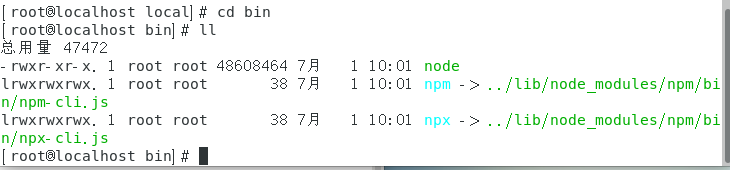

### 崔雨暑期第一次作业

#### 下载nodejs的Source Code版本安装包

先再本记下载对应版本安装包

```javascript
https://nodejs.org/download/release/v12.18.1/node-v12.18.1.tar.gz
```

之后通过XSell以及Xftp传输至虚拟机的ROOT账户中

解压压缩包

``tar -xvf node-v12.18.1.tar.gz``

创建一个新的空文件夹，将解压好的文件夹移入此目录

``mkdir software``

``mv node-v12.18.1/ software/``

``cd software``

``cd node-v12.18.1``

#### 提升gcc版本

> 由于CentOS 7 版本默认gcc的版本号为 4，要想成功执行./configure，必须将gcc的版本提升至6以上。

```Liunx
/*这是从Stackoverflow中找到的简易教程，不需要冗长的编译过程也可以提升gcc版本，但是是暂时的。在当前命令行内有效。*/
sudo yum install centos-release-scl
sudo yum install devtoolset-7-gcc*
scl enable devtoolset-7 bash
which gcc
gcc --version
```

#### 提取配置文件并编译安装

```Linux
./configure
make
make install
```

#### 最终结果

执行``make install``之后 直接检查版本node版本``node -v``

node版本为``v12.18.1``

检索配置目录 发现 node 自动安装到了``/usr/local/include``目录中，并在``/usr/local/bin``中发现了软连接




node文件夹中所包含的文件有:


#### 总结

从昨晚到刚刚完成编译安装

重装系统 x 3

下载node源码 x 10

更新 gcc x 6

编译 x n

很多次的编译都会在``make``的时候抛出异常

```Linux
make: *** [xxxxxx]: somthing is invalid xxxxxxxxxxx
make: exit 'root/node-v12.18.1/out'
make: [Makefile: 101 node] Error
```

在最后我将新解压的node压缩包放置在新建的software文件夹中以后顺利编译安装完成。