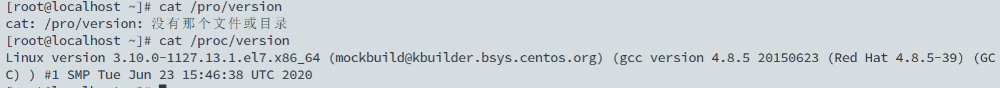
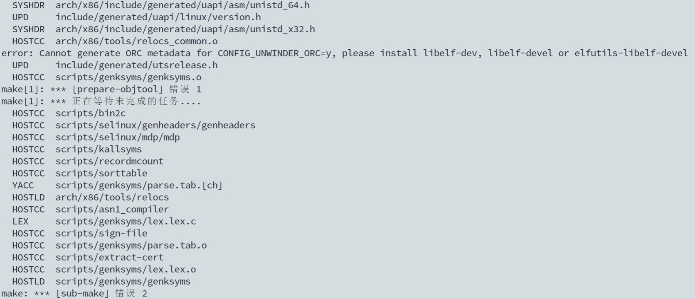
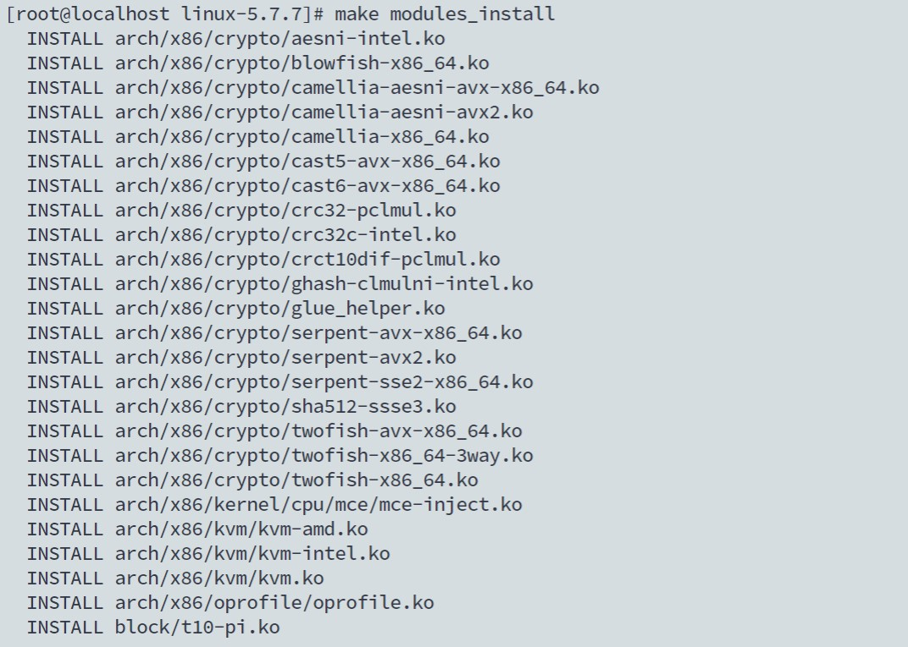
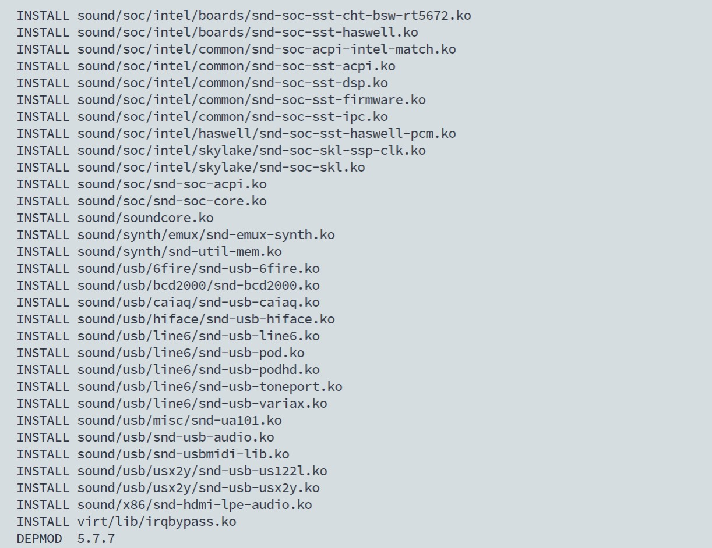
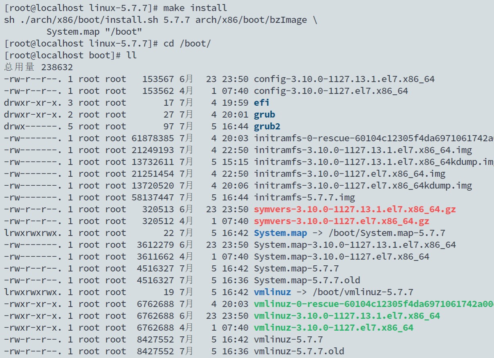
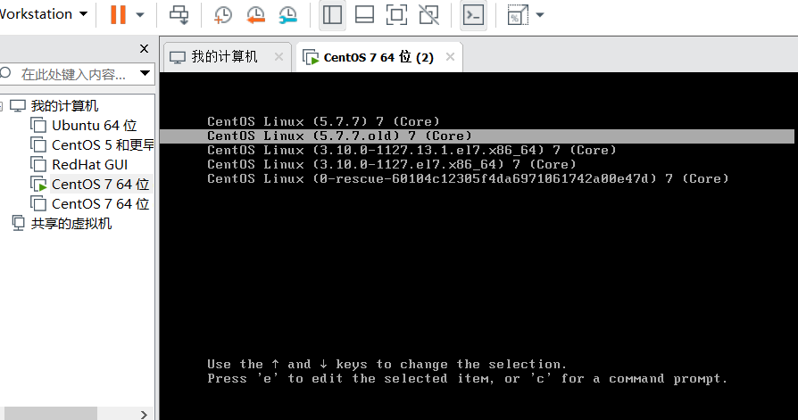
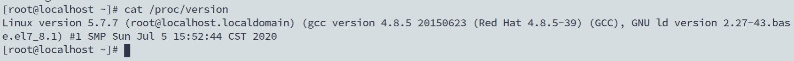

## Linux内核-崔雨

> 参考链接 https://blog.csdn.net/mrzhouxiaofei/article/details/79140435

今天编译安装Linux内核，过程比较顺利，没有碰到什么大问题。我当前的Linux内核的版本是3.10我们这次安装5.7.7版本。



**下载**

先在``usr/local/`` 下新建了名为``kernel``的目录，然后下载镜像文件。官网的下载速度有点慢所以我找到了一个比较快的镜像网站。

```
cd /usr/local
mkdir kernel
cd kernel
wget https://mirror.bjtu.edu.cn/kernel/linux/kernel/v5.x/linux-5.7.7.tar.gz
```

之后就解压压缩包

`` tar -zxvf linux-5.7.7.tar.gz``

``cd linux-5.7.7.tar.gz``

**配置文件**

接下来就是修改配置文件，因为我们是给自己的虚拟机升级，所以我直接从原有的配置文件中copy一份到当前目录

```
cp /boot/config-3.10.0-327.el7.x86_64 ./.config
```

这里可能会出现copy之后找不到``./config``的情况，这是因为``.``开头的文件是隐藏文件，可以使用``ll -a``查看当前目录的所有文件。

因为还有一些其他的配置可能会有不同，所以

```
make oldconfig
```

保留原有的配置文件然后再从原有基础上增加配置，直接选择默认配置 一路Enter就可以了

**编译-安装**

配置完之后就可以编译了。

根据自己的处理器内核数量选择参与编译的内核数量。

```
cat /proc/cpuinfo     cpu数量=[processor] + 1
```

进入安装目录后

```
make -j [内核数量] all      //使用一定数量的内核编译 所有模块
```



该过程需要 耐心等待，中间可能会出出现编译终止的情况，多数是因为确少环境，使用``yum``安装对应安装包即可

编译完成之后就可以安装了，第一步是安装模块

```
make modules_install
```



安装模块完成的样子



之后开始整体安装

```
make install
```



完成之后进入``/boot/``目录下就可以看到已经编译完成的新的内核

**修改引导文件-重启**

最后就是修改引导文件，开机的时候就会显示该内核启动方式

使用grub2-mkconfig来修改引导文件

```
grub2-mkconfig -o /boot/grub2/grub.cfg
```

*重新启动*就会显示更新的内核



进入系统检查内核版本

