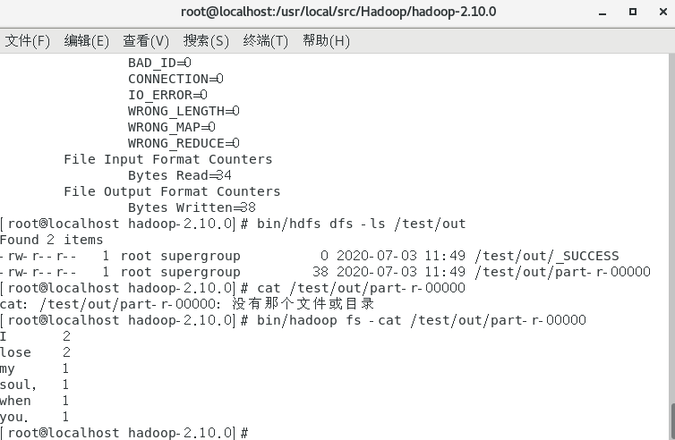
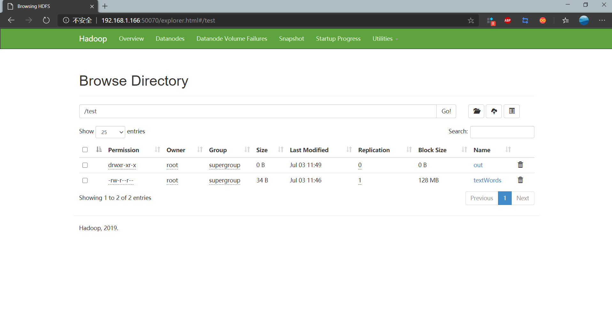

### Hadoop 崔雨

> 参考链接 https://www.cnblogs.com/hello-/articles/9600269.html
>
> 本机环境： Cent OS 7, Hadoop 2.10.0

#### 配置JAVA开发环境

用``yum``列出可下载的所有版本

``yum -y list java*``其实这里更建议使用``yum -y list *openjdk-devel*``

因为下载非devel版本可能会导致后续的部分命令无法使用

*devel版本与非devel版本的区别是：devel版本为开发版，包含了头文件、链接库等详细信息，供开发使用*

**下载jdk**

``yum install openjdk-devel-1.8.0``   *我第一次下载的是非devel版本*

**配置环境变量并检查版本**

```javascript
vim /ect/profile
/****加入到配置文件中
JAVA_HOME=/usr/local/jvm/jre-1.8.0XXXXXXXXXX
PATH=$PATH:$JAVA_HOME/bin:$PATH
**退出文档*****/
source /etc/profile
java -version
```

如果显示出java版本号则证明配置成功

#### 安装Hadoop

##### 下载安装包

创建新的文件夹存放解压文件

``mkdir /usr/local/src/hadoop``

前往官网下载 tar.gz版本

``wget http://mirrors.hust.edu.cn/apache/hadoop/core/hadoop-2.10.0/``

解压至新建的文件夹

#### 配置启动Hadoop

接下来就可以修改配置文件了，配置文件统一存放在hadoop文件夹的/etc/hadoop/目录下

配置修改可以参考文章开头的链接中的配置。

**配置ssh免密登录**

*起初我以为配置免密登录的原因是因为服务器环境下需要验证身份，虚拟机下不需要这个操作。但是当我真正启动服务的时候，服务启动过程中多次提示瑶输入账户密码，方便起见我也配置了免密登录。*

<u>参考文档中操作</u>

1.创建ssh-key，这里我们采用rsa方式，使用如下命令：

　　　　``ssh-keygen -t rsa -P ""``

2.出现一个图形，出现的图形就是密码，不用管它

　　　　``cat ~/.ssh/id_rsa.pub >> authorized_keys``

3.然后即可无密码验证登录了，如下：

　　　　``ssh localhost``

> 我使用的是上述流程但是并没有实现免密登录，是因为我当时不在根目录，第二步的``authorized_keys``直接保存在了Hadoop目录下。后来我换了一个命令，
>
> ``ssh-copy-id remote_username@server_ip_address``
>
> 实际操作就是
>
> ``ssh-copy-id root@localhost`
>
> 之后使用命令 ``ssh localhost``就可以直接登录成功了

#### 测试效果

**运行Hadoop**

　　<u>在配置完成后，运行hadoop。</u>

　　**1.初始化HDFS系统**

　　　　在hadop2.7.1目录下使用如下命令：

　　　　``bin/hdfs namenode -format``

　　　　过程需要进行ssh验证，之前已经登录了，所以初始化过程之间键入y即可。

　　　　成功的截图如下：

　　　　表示已经初始化完成。

　　**2.开启`NameNode`和`DataNode`守护进程**

　　　　使用如下命令开启：

　　　　`sbin/start-dfs.sh，成功的截图如下：`

这中间出现了JAVA_HOME找不到的错误，我没有去环境变量解决，我在``hadoop.env.sh``文件中为hadoop指定了JAVA_HOME路径。

　　**3.查看进程信息以及web页面**

　　　　使用如下命令查看进程信息

　　　　``jps``，截图如下：


　　　　表示数据DataNode和NameNode都已经开启


**4.使用常用命令完成wordcount demo**

在HDFS中新建一个文件夹，用于上传本地的words文档，在hadoop2.7.1目录下输入如下命令：

``bin/hdfs dfs -mkdir /test``

表示在hdfs的根目录下建立了一个test目录

使用如下命令可以查看HDFS根目录下的目录结构

``bin/hdfs dfs -ls /``

在home目录下新建一个textWords文件，输入字符

使用如下命令进行上传操作：

``bin/hdfs dfs -put /home/words/textWords /test/``

使用如下命令进行查看

``bin/hdfs dfs -ls /test/``

运行wordcount

``bin/hadoop jar share/hadoop/mapreduce/hadoop-mapreduce-examples-2.10.0.jar wordcount /test/textWords /test/out``

此时``out/``文件夹中多了输出文件，查看一下输出文件




可以看到单词统计信息。

从浏览器也可以查看Hadoop创建的文件目录系统中的文件



**常用命令**

调用/bin/hadoop 命令 为 ./bin/hadoop fs [-config] 的形式

-cat [URI] 打印文件中的内容到stdout中

-put [SOURCE] [TARGET] 上传源文件到目标文件夹中

-mv [SOURCE] [TARGET] 源文件移动到目标文件中

-mkdir [path] 在指定路径下创建空文件夹

-rm [URI] 删除指定文件

-rmr [URI] 递归删除指定文件夹

