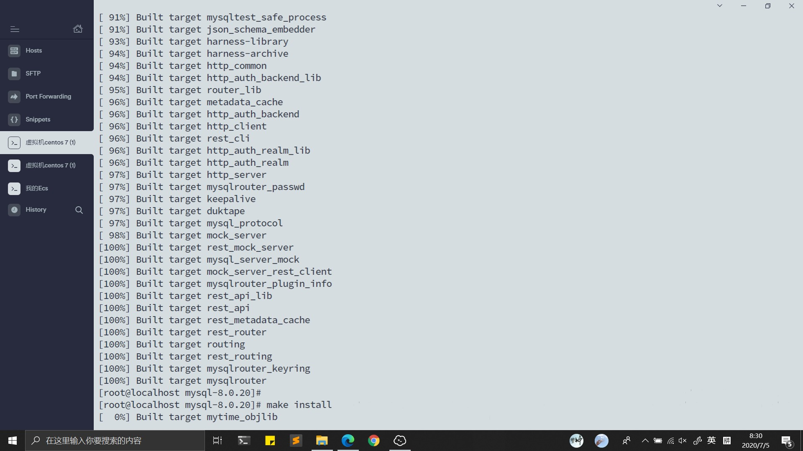
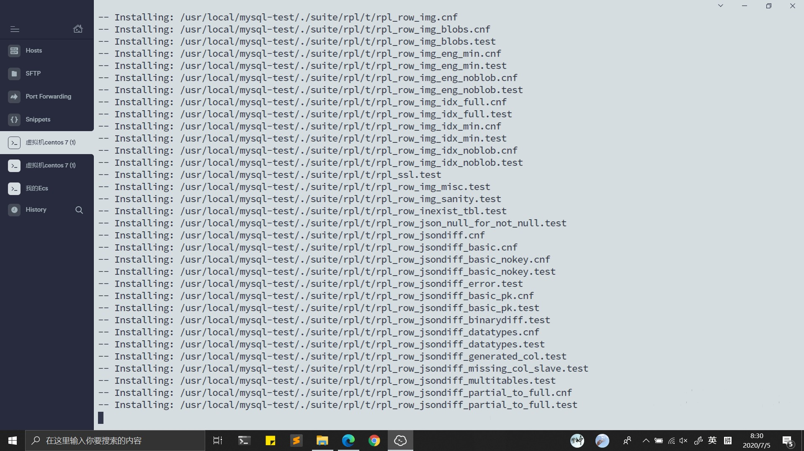
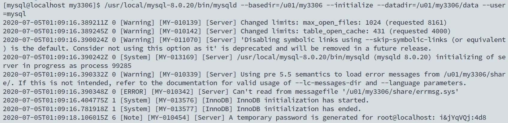
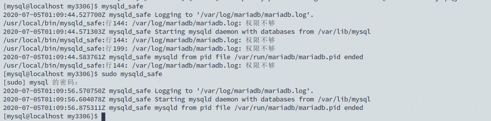
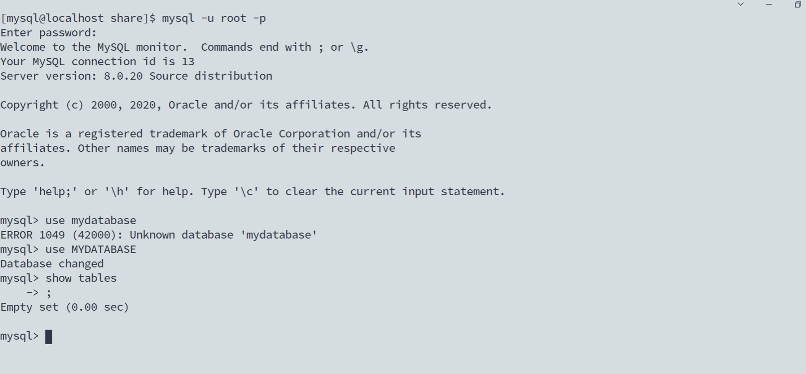

### MySQL-崔雨

#### 一、安装准备

**所需工具**

+ cmake
+ gcc
+ boost
+ ncurses
+ openssl
+ bison
+ doxygen

**使用yum进行安装**

上述的部分工具我已经安装了

``yum install -y make bison ncurses-devel doxygen libtirpc-devel``

**提升cmake版本**

编译mysql的时候需要使用cmake，我的cmake起初的版本是2.8，很多同学在编译的时候提示cmake需要升级，我索性就直接升级了。

同样是参考链接中的升级教程

```Linux
cd /user/local/src
wget https://github.com/Kitware/CMake/releases/download/v3.14.5/cmake-3.14.5.tar.Z
tar -zxvf cmake-3.14.5.tar.z
./bootstrap

make && make install（这里应该可以 通过 make -j 4指定编译的核数来提高编译速度）
```

编译安装顺利，结束后检查cmake版本

``cmake --version``

#### 二、安装MySQL

``wget https://dev.mysql.com/get/Downloads/MySQL-8.0/mysql-boost-8.0.20.tar.gz``

解压安装包

``tar -zxvf mysql-boost-8.0.20.tar.gz``

将解压后的文件移动到``/usr/local目录下

``mv mysql-boost-8.0.20 /usr/local``

借助教程中的配置文件进行编译安装

```
-- 上一步解压的位置
cd /usr/local/mysql-8.0.20
--cmake编译安装
cmake . \
-DWITH_BOOST=/usr/local/mysql-8.0.20/boost/boost_1_70_0 \
-DWITHOUT_CSV_STORAGE_ENGINE=1 \
-DWITHOUT_FEDERATED_STORAGE_ENGINE=1 \
-DWITHOUT_ARCHIVE_STORAGE_ENGINE=1 \
-DFORCE_INSOURCE_BUILD=1 \
-DWITH_SSL=system \

make -j 8 && make install

```

过程比较漫长请耐心等待





**PS：**make的时候通过参数 ``-j``可以指定参与编译的核数，我的参数是 ``make -j 8``，虚拟机是八核，但是每次都会因为内存不够而崩溃，我认为应该是由于运行速度太快内存来不及释放，所以就只使用默认配置来进行了 ``make `` ,时间较长，但是最终成功了，也完成了``make install``

**安装完成**

安装完成之后修改配置文件，具体参数可以参考上文链接。教程中的操作是新建用户组并专门为MySQL新建了用户，这样可以为了便于操作，我的第一次安装并没有新建用户，也是可以的，只是必须要有MySQL运行的相关文件，``data、log、share、my.conf``都必须要有（默认在``/etc/my.cnf``中有一份默认的配置文件，他指向的是``/lib/``文件夹），在修改配置文件的时候直接指定你修改好的目录就好。

为了便于操作，我的第二次安装创建了对应的MySQL操作用户

所以我就按照链接中的操作进行了**初始化**



注意：使用``mysqld``启动服务的时候可能会出现找不到命令的情况，这是因为没有配置环境变量，指定命令的位置就好，我这里是安装在``/usr/local/mysql-8.0.20/bin/mysqld``，记得保存早初始话完成之后生成的随机密码

如果此时检查用户目录下的``data``中已经有了数据，那么证明初始化完成了。接下来进行安装

**启动服务**

``mysqld_safe --defaults-file=/u01/my3306/my.cnf``

注意``defaults-file``后指定的是配置文件的路径。



如果此时显示

``mysqld_safe is start daemon service xxxx``

就证明服务已经启动成功了，这是我们新建一个终端，输入``mysql -u root -p`` 提示我们 输入密码，输入方才保存的默认生成的密码，

刚才的密码是随机生成的，我们把他换掉

``ALTER USER root@localhost IDENTIFIED BY '新密码';``

之后就修改成功了，然后我们``exit;``之后重新用新的密码就可以登录成功了。

**插入数据**



这个地方就就不再赘述了。


